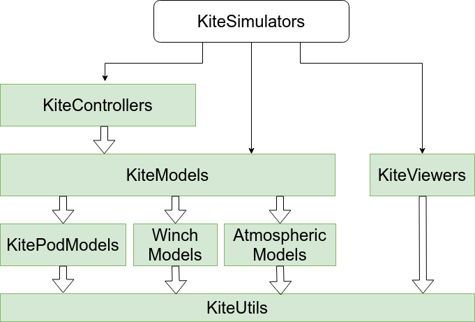

# KitePodModels

[](https://aenarete.github.io/KitePodModels.jl/stable)
[](https://aenarete.github.io/KitePodModels.jl/dev)
[](https://github.com/aenarete/KitePodModels.jl/actions/workflows/CI.yml?query=branch%3Amain)
[](https://codecov.io/gh/aenarete/KitePodModels.jl)

Models of control pods for kite power systems.

This package is part of Julia Kite Power Tools, which consist of the following packages:
<p align="center"></p>

## Background
A kite pod or kite control unit consists of one or two electric miniature winches, that pull on two or three lines (attached to the kite) and allow to steer the kite and to change the angle of attack and thus the lift.

This software acts as controller: It has two inputs, the set values, and two outputs, the actual values.

Two P controllers are used. 

The geometric nonlinearity due to the change of the effective drum diameter of the drum with the depower tape is taken into account.

## Installation
Follow the instructions at [Installation of Julia](https://ufechner7.github.io/2024/08/09/installing-julia-with-juliaup.html), using Julia 1.10 or later. Then you can add `KitePodModels` from  Julia's package manager, by typing 
```julia
using Pkg
pkg"add KitePodModels"
``` 
at the Julia prompt.

## Testing
You can run the unit test suite with the following command:
```julia
pkg"test KitePodModels"
```

## Provides
- functions to initialize the model, update the set values and read the actual values
- a function KitePodModels.on_timer() that needs to be called once per time step
- a function to convert the actual depower value into change of angle of attack

### Configuration
There are two types of kite control unit models, called KCU1 and KCU2. 
For KCU1 the following parameters are used:
```yaml
kcu:
    kcu_model: "KCU1"            # name of the kite control unit model, KCU1 or KCU2
    kcu_mass: 8.4                # mass of the kite control unit                      [kg]
    power2steer_dist: 1.3        #                                                     [m]
    depower_drum_diameter: 0.069 #                                                     [m]
    tape_thickness: 0.0006       #                                                     [m]
    v_depower: 0.075 # max velocity of depowering in units per second (full range: 1 unit)
    v_steering: 0.2  # max velocity of steering in units per second  (full range: 2 units)
    depower_gain: 3.0            # 3.0 means: more than 33% error -> full speed
    steering_gain: 3.0

```

For KCU2 the following parameters are used:
```yaml
kcu:
    kcu_model: "KCU2"              # name of the kite control unit model, KCU1 or KCU2
    kcu_mass: 15.0                 # mass of the kite control unit                    [kg]
    kcu_diameter: 0.4              # diameter of the KCU for drag calculation          [m]
    depower_zero: 38.0             # depower setting for alpha_zero = 0                [%]
    degrees_per_percent_power: 1.0 # linear approximation                      [degrees/%]
    v_depower: 0.053  # max velocity of depowering in units per second (full range: 1 unit)
    v_steering: 0.212 # max velocity of steering in units per second (full range: 2 units)
    depower_gain: 3.0              # 3.0 means: more than 33% error -> full speed
    steering_gain: 3.0
```

## Nomenclature
- depower: a value between 0% and 100%; zero corresponds to the power line being fully reeled-in
- rel_depower: a value between 0.0 and 1.0
- depower_offset: 23.6   # at rel_depower=0.236 the kite is fully powered [%]
- alpha_depower: the change of the angle between the kite and the last tether segment [rad]

## Licence
This project is licensed under the MIT License. Please see the below WAIVER in association with the license.

## WAIVER
Technische Universiteit Delft hereby disclaims all copyright interest in the package “KitePodModels.jl” (models for airborne wind energy systems) written by the Author(s).

## Related
- The meta-package  [KiteSimulators](https://github.com/aenarete/KiteSimulators.jl)
- the package [KiteUtils](https://github.com/ufechner7/KiteUtils.jl)
- the packages [KiteModels](https://github.com/ufechner7/KiteModels.jl) and [WinchModels](https://github.com/aenarete/WinchModels.jl) and [AtmosphericModels](https://github.com/aenarete/AtmosphericModels.jl)
- the packages [KiteControllers](https://github.com/aenarete/KiteControllers.jl) and[KiteViewers](https://github.com/aenarete/KiteViewers.jl)

**Documentation** [Stable Version](https://aenarete.github.io/KitePodModels.jl/stable) [Development Version](https://aenarete.github.io/KitePodModels.jl/dev)

Author: Uwe Fechner (uwe.fechner.msc@gmail.com)
