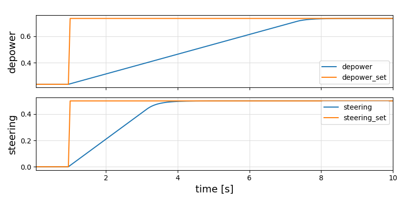

```@meta
CurrentModule = KitePodSimulator
```

# KitePodSimulator

Documentation for [KitePodSimulator](https://github.com/ufechner7/KitePodSimulator.jl).

## Background
A kite pod or kite control unit consists of one or two electric miniatur winches, that pull on two or three lines (attached to the kite) and allow to steer the kite and to change the angle of attack and thus the lift.

This software acts as controller: It has two inputs, the set values, and two outputs, the actual values.

Two P controllers are used. 

The geometric nonlinearity due to the change of the effectiv drum diameter of the drum with the depower tape is taken into account.

## Installation

Download [Julia 1.6](http://www.julialang.org) or later, if you haven't already. You can add KiteUtils from  Julia's package manager, by typing 
```
] add KiteUtils
``` 
at the Julia prompt.

If you are using Windows, it is suggested to install git and bash, too. This is explained for example here: [Julia on Windows](https://github.com/ufechner7/KiteViewer/blob/main/doc/Windows.md) .

## Provides

- functions to initialize the simulator, to update the set values and to read the actual values
- a function on_timer() that needs to be called once per time step
- a function to convert the actual depower value into change of angle of attack

## Step response


Click on **Functions** on the left to see the exported functions.

Author: Uwe Fechner (uwe.fechner.msc@gmail.com)
